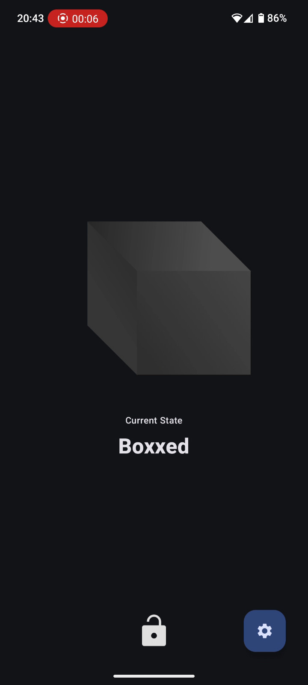
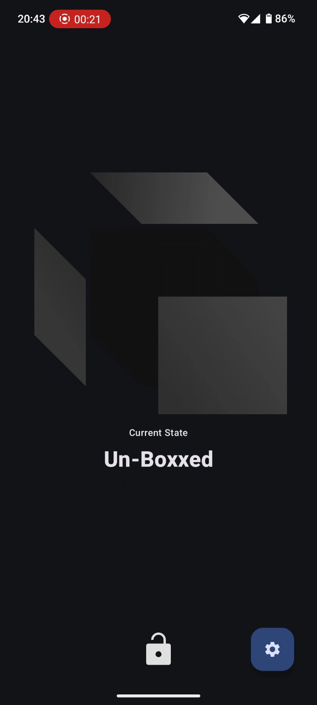

# The Boxx
*technology to control your technology*

An Android app that restricts your phone, blocking certain apps. It is different than your "average screen time app" because it only allows you to block/unblock your phone if you scan an NFC tag. That way, you can leave your NFC tag at home when you go to work and block Instagram, YouTube etc. to maximize your productivity.

This project was heavily inspired by [Brick](https://getbrick.app/) and the other [FOSS](## "Free & Open Source Software") alternatives ([Foqos](https://github.com/awaseem/foqos), [Broke](https://github.com/OzTamir/broke)). Since there was no good alternative on Android, I decided to create my first *real* Android app. Hope you enjoy!

## Usage
Still a work in progress. Hopefully APKs will be available soon :).

## Screenshots
 